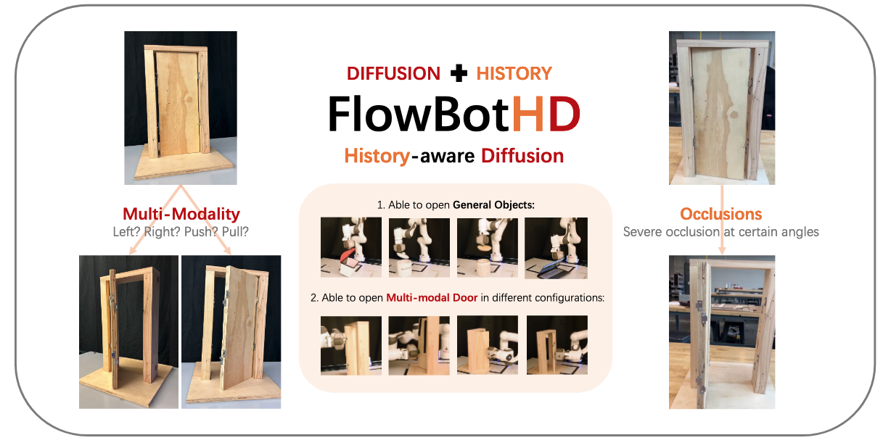

# FlowBotHD

[FlowBotHD](https://flowbothd.github.io/) is a history-aware diffusion handling ambiguities (multi-modality and occlusion) in articulated objects.




## Installation

```{bash}
conda create -n flowbothd python=3.9

conda activate flowbothd

pip install torch==2.0.1 torchvision==0.15.2 torchaudio==2.0.2 --index-url https://download.pytorch.org/whl/cu118

pip install -r requirements.txt
```

> Note: Make sure you install pytorch with regard to your machine's CUDA version. If you want to change the cuda version, you also need to change the cuda version specified in requirements.txt


Then we have to also install the flowbothd package itself. [Make sure you are directly under the flowbothd directory, where you can see pyproject.toml]

```{bash}
pip install .
```

## Demo

For a quick start and overview, our `demo.ipynb` demonstrates the demo pipeline of generating prediction (given real-world point clouds) and simulation (given any partnet-mobility object) given a pretrained model.

## Dataset

Please download PartNet-Mobility Dataset dataset from [partnet-mobility](https://sapien.ucsd.edu/downloads). And edit the `data_dir` in `configs/dataset/trajectory.yaml` to the path you save your dataset

## Train


### STEP 0 : Set the config files

0) configs/_logging.yaml:

    Set the `wandb.entity` and `wandb.project` for wandb logging.

1) configs/train.yaml: 

    Choose model
    - `model`: diffuser_hispndit (FlowBotHD) / artflownet (FlowBot3D) / other structures we've tried whose names are listed in the configs/model/.

2) configs/dataset/trajectory.yaml

    `dataset_type`: full-dataset for training and evaluating on full partnet-mobility, doors-only for training and evaluating only on the most ambiguous category: doors.

3) configs/training/trajectory_{model.name}.yaml

    Change the corresponding detailed configs for the training process: `learning_rate`, `batch_size`, `warmup_steps`.

4) configs/model/{model.name}.yaml

    Change the detailed configs for the model (Only needed for diffusion)

    - `num_train_timesteps`: diffusion timestep

### STEP 1 : Run training script
```
python scripts/train.py
```

## Eval and Simulation

If you want to evaluate (calculate the basic cosine, mag, rmse metrics across dataset) and evaluate the simulation (calculate the success rate, normalized distance) of a trained model:

### STEP 0 : Set the config files and specify the ckpt

1. Specify the checkpoint / run you are evaluating:

    Set `checkpoint.run_id` and `wandb.group` with the run_id and the group name of the run to be evaluated.

2. Set the same `model`, `dataset_type` etc as the training config files above.

3. In the evaluation / simulation script you want to run, specify the ckpt_file = "PATH_FILE"

4. For simulation: 
- in `eval_sim.yaml`, specify `sgp`, `consistency_check`, `history_filter` for the 3 policy components. 
- Use `gui = True` if you want to visualize the simulation process while running (but it will be slower, and don't work on remote ssh.)
- Use `website = True` if you want to save all the simulation videos and also generate a website. For website, go to your log directory, and start a server under the specific log directory `log/simu_eval/`

### STEP 1 : Run evaluation / simulation

For evaluating diffuser-based methods with history (that needs winner-take-all metric, meaning multiple samples and take the best metric):

```{bash} 
python scripts/eval_history_diffuser_wta.py  # For basic evaluation
python scripts/eval_sim_diffuser_history.py  # For simulation
python scripts/eval_sim_diffuser.py          # For simulation with model trained without history
```

For evaluating regression-based method (flowbot3d):
```{bash}
python scripts/eval.py                       # For basic evaluation
python scripts/eval_sim.py                   # For simulation
```


## Run Specified Subset Experiment

Need to change scripts/train.py for training and scripts/eval(_sim).py for evaluation:

When creating dataset, specify the arguments `special_req` and `toy_dataset`.

1) special_req: 

- "half-half-01"(Part of data fully closed, part of data randomly opened, with 0 or 1-step history)
- "fully-closed"(All of data fully closed)
- "randomly-open"(All of the data randomly open)

2) toy_dataset: a dict to specify a small dataset
- id: the name for the toy dataset
- train-train: the ids for the training set
- train-test: the ids for the validation set
- test: the ids for the test set

An Example:
```
# Create FlowBot dataset
datamodule = data_module_class[cfg.dataset.name](
    root=cfg.dataset.data_dir,
    batch_size=cfg.training.batch_size,
    num_workers=cfg.resources.num_workers,
    n_proc=cfg.resources.n_proc_per_worker,
    seed=cfg.seed,
    trajectory_len=trajectory_len, 
    special_req="half-half-01"
    toy_dataset = {
        "id": "door-1",
        "train-train": ["8994", "9035"],
        "train-test": ["8994", "9035"],
        "test": ["8867"],
    }
)
```

Then run train and eval exactly like before.

## Cite

If you find this codebase useful in your research, please consider citing:

```
@inproceedings{liflowbothd,
  title={FlowBotHD: History-Aware Diffuser Handling Ambiguities in Articulated Objects Manipulation},
  author={Li, Yishu and Leng, Wen Hui and Fang, Yiming and Eisner, Ben and Held, David},
  booktitle={8th Annual Conference on Robot Learning}
}
```


